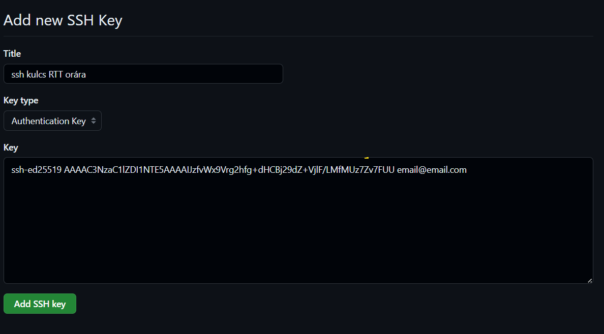
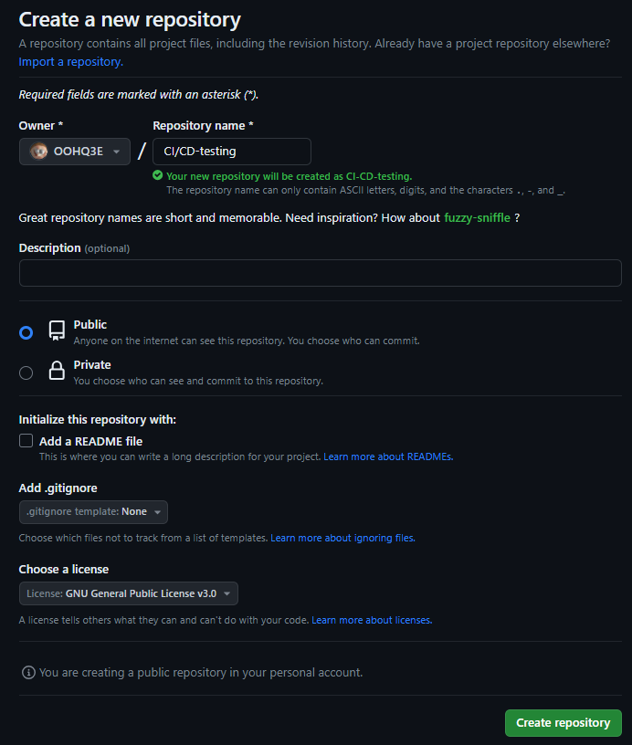
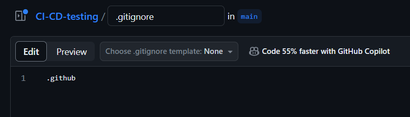
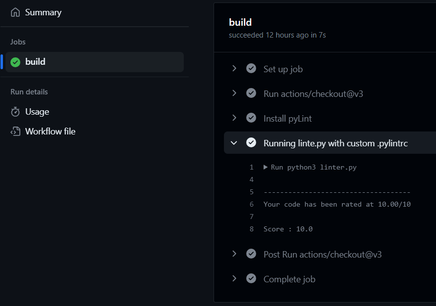

# CI/CD - Rendszerek Tervezése és tesztelése

 Verziókezelők lehetőséget adnak arra, hogy az egyes műveleteik különféle programok lefutását triggereljék. Ez az alapja az úgynevezett CI/CD Continuous Integration (CI), Continuous Delivery (CD) megoldásoknak. A mi esetünkben egy Linter-t fogunk lefuttatni az előző órai kódunkon minden push esetén.

## 1. SSH kulcs felvétele a GitHub-on

Amennyiben a GitHub-on ssh-n szeretnénk bejelentkezni, érdemes felvenni az adott projekthez hozzáférést biztosító nyilvános kulcsokat. Ehhez a Profil > Settings > SSH and GPK Keys menüben kell hozzáadni mindazok kulcsát, akik számára hozzáférést szeretnénk biztosítani.

Először is SSH kulcsot kell generálnunk az alábbiak szerint:
Ha van git a gépünkre feltelepítve, akkor az alábbi terminálba beírt utasítással tudjuk ezt megtenni: ```ssh-keygen -t ed25519 -C "sajatEmailed@email.hu"```. Ezek után megadjuk hogy milyen néven szeretnénk ezt elmenteni, példa esetében legyen ez "ssh-kulcs". Ezután (ha akarunk) meg lehet adni ehhez egy passkey-t, amit hogy ha nem akarunk megadni, akkor csak nyomjunk Enter-t. Amennyiben minden megfelelő volt, akkor 2 fájlt találunk abban a mappában, ahol a terminált megnyitottuk: "ssh-kulcs", és "ssh-kulcs.pub". Nyissuk meg a publikus kulcsot tartalmazó fájlt, a "ssh-kulcs.pub"-ot, és másoljuk ki annak a tartalmát.
GitHubon menjünk a "New SSH Key"-re és íjruk be az alábbiakat:


## 2. Workflow létrehozása GitHub Repositoryban

### 2.1 Repository létrehozása

Hozzunk létre egy új repository-t, amiben dolgozni fogunk az akábbiak szerint:



Majd adjunk hozzá ezek után egy .gitignore fájlt az alábbiak szerint:



A tesztelést végző action scripteket nem szeretnénk mozgatni, ezért a .github könyvtárat hozzáadjuk a .gitignore fájl tartalmához,ezek után commit>push.

### 2.2 Workflow beállítása

Ezek után válasszuk ki az "Actions" fület, és a "Simple Actions"-nél kattintsunk a Configure-ra.
Ezek után állítsuk be a fájl nevét "linter.yml"-re, majd és az alábbi kódot írjuk be:

```yml
name: Linter
on:
  push:
    branches: [ "main" ]

jobs:
  build:
    runs-on: ubuntu-latest
    steps:
    - uses: actions/checkout@v3

    - name: Install pyLint
      run: pip install pylint

    - name: Running linte.py with custom .pylintrc
      run: python3 linter.py
      continue-on-error: false
```

Itt beállítjuk hogy mi legyen a futtató környezet a sandbox-unknak, és hogy milyen utasítások menjenek végbe. Itt beállítjuk azt, hogy ubuntu rendszer alatt fusson, telepítse a pylint-et, és futtassa a később létrehozott "linter.py" fájlunkat. (Megjegyezendő, hogy több utasítást, és linter-t is hozzá lehet adni, csak akkor azt egy új lépésként kell megadni ugyan úgy, mint az utolsó blokkunkat.)

Amint készen vagyunk, commit>push.

## 3. Workflow használata

Legelőször sikertelennek fogja ezt jelezni, mivel még nincs meg a "linter.py" fájlunk.

Használjuk az előző órai kódunkat, egy kis módosítással.

"pylint.py" tartalma:

```python
import sys
from pylint import lint

THRESHOLD = 10
run = lint.Run(["--rcfile=.pylintrc", "main.py"], exit=False)
score = run.linter.stats.global_note

print(f"Score : {score}")

if score < THRESHOLD:
    print(f"Linter failed, Score:{score} < threshold value: {THRESHOLD}")
    sys.exit(1)
sys.exit(0)
```

Annyit változtattunk meg benne, hogy megadtuk a custom linter szabályokat leíró fájlunkat, a ".pylintrc"-t.

Amint készen vagyunk ezzel, akkor ismét commit>push.

Ezek után azért fog hibát adni a Workflow, mivel nem találja a "linter.py" se a ".pylintrc"-t, sem a "main.py" fájlunkat, szóval hozzuk ezeket is létre az előző órai kód alapján.

Miután meg vagyunk ezekkel is, akkor ismét commit>push.

Ezek után meg tudjuk nézni a Workflow adott job-ját, és ott meg tudjuk nézni, hogy a linterünk elfogadta-e a fájlunkat a megadott szabályok szerint:



Amennyiben bizonyos kritériumok nem teljesülnek, akkor azokat javítsuk ki, és a build-ünk helyesen fusson le.

(Megjegyezendő, hogy minden failed build esetén email-t fogunk kapni a githubtől erről, szóval majd erre figyeljünk oda.)
